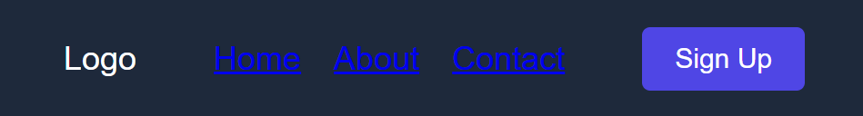
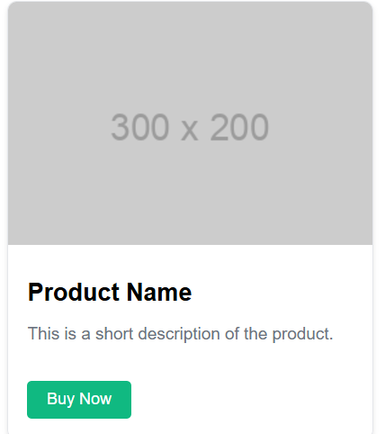
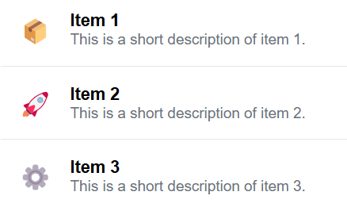

# Ejercicios con Tailwind

El objetivo es que, para cada ejercicio presentado con un ejemplo en HTML y CSS puro, repliquen el componente utilizando exclusivamente clases de Tailwind CSS, logrando el mismo diseño y funcionalidad. Esto les permitirá comprender cómo traducir estilos tradicionales a un enfoque basado en utilidades.

## Instrucciones Generales

1. Como siempre, busca identificar la estructura antes de aplicar, puedes apoyarte en la estructura de cada ejemplo.
2. Utiliza los cheatsheets utilizados en clase:
    - https://www.creative-tim.com/twcomponents/cheatsheet
    - https://umeshmk.github.io/Tailwindcss-cheatsheet/
3. Puedes utilizar iconos como imagenes de: https://boxicons.com/

> [!TIP]
> No busques perfección, busca acercarte y mejorar en cada iteración

### **Ejercicio 1: Construir un Header con navegación**

**Idea:**  
Construir un encabezado con un logo a la izquierda, un menú de navegación centrado, y un botón de acción a la derecha. El desafío es replicarlo usando las clases de Tailwind.



**Ejemplo con HTML y CSS puro:**

```html
<!DOCTYPE html>
<html lang="en">
<head>
  <meta charset="UTF-8">
  <meta name="viewport" content="width=device-width, initial-scale=1.0">
  <title>Header</title>
  <style>
    body {
      margin: 0;
      font-family: Arial, sans-serif;
    }
    .header {
      display: flex;
      justify-content: space-between;
      align-items: center;
      padding: 1rem 2rem;
      background-color: #1e293b;
      color: #fff;
    }
    .nav {
      display: flex;
      gap: 1rem;
    }
    .button {
      background-color: #4f46e5;
      color: white;
      padding: 0.5rem 1rem;
      border: none;
      border-radius: 0.25rem;
      cursor: pointer;
    }
    .button:hover {
      background-color: #3b82f6;
    }
  </style>
</head>
<body>
  <header class="header">
    <div>Logo</div>
    <nav class="nav">
      <a href="#">Home</a>
      <a href="#">About</a>
      <a href="#">Contact</a>
    </nav>
    <button class="button">Sign Up</button>
  </header>
</body>
</html>
```

**Desafío con Tailwind CSS:**  
Recrear el mismo componente usando únicamente clases de Tailwind CSS. Asegúrate de agregar estilos responsivos y un hover para el botón.

---

### **Ejercicio 2: Tarjeta de producto**



**Idea:**  
Crear una tarjeta vertical con una imagen, un título, una descripción y un botón. Ideal para practicar el diseño de componentes.

**Ejemplo con HTML y CSS puro:**

```html
<!DOCTYPE html>
<html lang="en">
<head>
  <meta charset="UTF-8">
  <meta name="viewport" content="width=device-width, initial-scale=1.0">
  <title>Product Card</title>
  <style>
    .card {
      width: 300px;
      border: 1px solid #e5e7eb;
      border-radius: 0.5rem;
      overflow: hidden;
      box-shadow: 0 2px 4px rgba(0, 0, 0, 0.1);
    }
    .card img {
      width: 100%;
      height: 200px;
      object-fit: cover;
    }
    .card-content {
      padding: 1rem;
    }
    .card-title {
      font-size: 1.25rem;
      margin: 0.5rem 0;
    }
    .card-description {
      font-size: 0.875rem;
      color: #6b7280;
    }
    .card-button {
      margin-top: 1rem;
      background-color: #10b981;
      color: white;
      padding: 0.5rem 1rem;
      border: none;
      border-radius: 0.25rem;
      cursor: pointer;
    }
    .card-button:hover {
      background-color: #059669;
    }
  </style>
</head>
<body>
  <div class="card">
    
    <div class="card-content">
      <h3 class="card-title">Product Name</h3>
      <p class="card-description">This is a short description of the product.</p>
      <button class="card-button">Buy Now</button>
    </div>
  </div>
</body>
</html>
```

**Desafío con Tailwind CSS:**  
Recrear esta tarjeta utilizando las clases de Tailwind. Experimenta con estilos adicionales como hover en el botón o sombras en la tarjeta.

---

### **Ejercicio 3: Lista de elementos atractiva**

**Idea:**  
Diseñar una lista ordenada con iconos, títulos y descripciones para cada elemento. El objetivo es crear una lista que sea visualmente clara y moderna.



**Ejemplo con HTML y CSS puro:**

```html
<!DOCTYPE html>
<html lang="en">
<head>
  <meta charset="UTF-8">
  <meta name="viewport" content="width=device-width, initial-scale=1.0">
  <title>List</title>
  <style>
    .list {
      list-style: none;
      padding: 0;
      margin: 0;
    }
    .list-item {
      display: flex;
      align-items: center;
      gap: 1rem;
      padding: 1rem;
      border-bottom: 1px solid #e5e7eb;
    }
    .list-item:last-child {
      border-bottom: none;
    }
    .icon {
      font-size: 1.5rem;
      color: #4f46e5;
    }
    .content {
      flex: 1;
    }
    .title {
      font-weight: bold;
      margin: 0;
    }
    .description {
      margin: 0;
      font-size: 0.875rem;
      color: #6b7280;
    }
  </style>
</head>
<body>
  <ul class="list">
    <li class="list-item">
      <span class="icon">📦</span>
      <div class="content">
        <p class="title">Item 1</p>
        <p class="description">This is a short description of item 1.</p>
      </div>
    </li>
    <li class="list-item">
      <span class="icon">🚀</span>
      <div class="content">
        <p class="title">Item 2</p>
        <p class="description">This is a short description of item 2.</p>
      </div>
    </li>
    <li class="list-item">
      <span class="icon">⚙️</span>
      <div class="content">
        <p class="title">Item 3</p>
        <p class="description">This is a short description of item 3.</p>
      </div>
    </li>
  </ul>
</body>
</html>
```

**Desafío con Tailwind CSS:**  
Recrear esta lista con Tailwind, incluyendo estilos responsivos, colores personalizados, y cualquier mejora visual que creas adecuada.